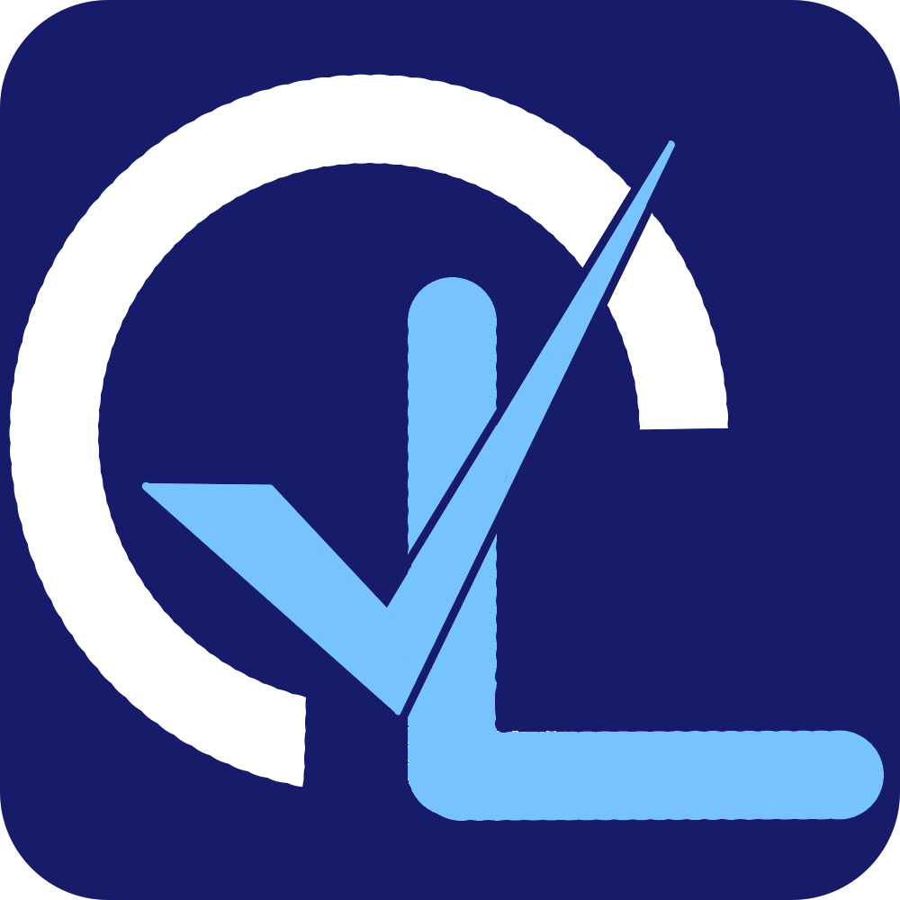

# OnLiPos - いつでも、どこでも、かんたんに使えるPOSレジシステム

  

`OnLiPos` は、パソコンやタブレットで使える、高機能なクラウド型POSレジシステムです。
小規模な個人店から、複数の店舗を持つチェーン店まで、様々なお店の会計業務をスマートにサポートします。

[OnliPos ホームページ](https://onlipos.com "Onlipos")

## OnLiPosとは？

日々のレジ業務、売上や在庫の管理、複数店舗の運営...。お店の経営にはたくさんの仕事があります。`OnLiPos`は、これらの複雑な業務をシンプルにするために開発されました。専用の高価なレジ機はもう必要ありません。あなたがお持ちのデバイスが、そのまま高機能なPOSレジになります。

## 主な機能

- **かんたん会計**: 直感的な操作で、誰でもすぐに使いこなせる販売画面
- **商品管理**: 写真付きのメニューや、詳細な商品情報の登録
- **在庫管理**: 店舗ごとの在庫数をリアルタイムに把握
- **従業員管理**: スタッフごとのアクセス権限設定
- **複数店舗対応**: すべての店舗の売上や在庫をまとめて管理
- **売上分析**: Webダッシュボードで、いつでもどこでも売上状況を確認

## こんな方におすすめ

- 自分のお店にぴったりのPOSレジを導入したい個人店オーナーの方
- 低コストで高機能なレジシステムを探している方
- 複数の店舗の売上や在庫をまとめて管理したい方

## OnLiPosの3つの特徴

### 1. お手持ちのデバイスがレジになる
専用のレジ機は不要です。お使いのパソコン（Windows, Mac, Linux）やタブレット（iPad, Android）が、そのまま高性能なレジになります。

### 2. オフラインでも止まらない安心感
インターネット接続が不安定な場所や、万が一の通信障害時でも、会計業務を止めることはありません。販売情報はアプリ内に安全に保存され、オンラインに復帰した際に自動でクラウドと同期されます。

### 3. クラウドでいつでもどこでも一元管理
売上データや商品情報はすべてクラウド上で安全に管理されます。経営者は、いつでもどこでもWebブラウザから最新の状況を確認したり、商品の価格を変更したりできます。

---

## はじめかた (開発者向け)

開発環境のセットアップ方法や貢献の方法については、`CONTRIBUTING.md`（現在準備中）をご覧ください。

## ライセンス

このソフトウェアは **MIT License** の下で公開されています。
詳細は `LICENSE` ファイルをご覧ください。